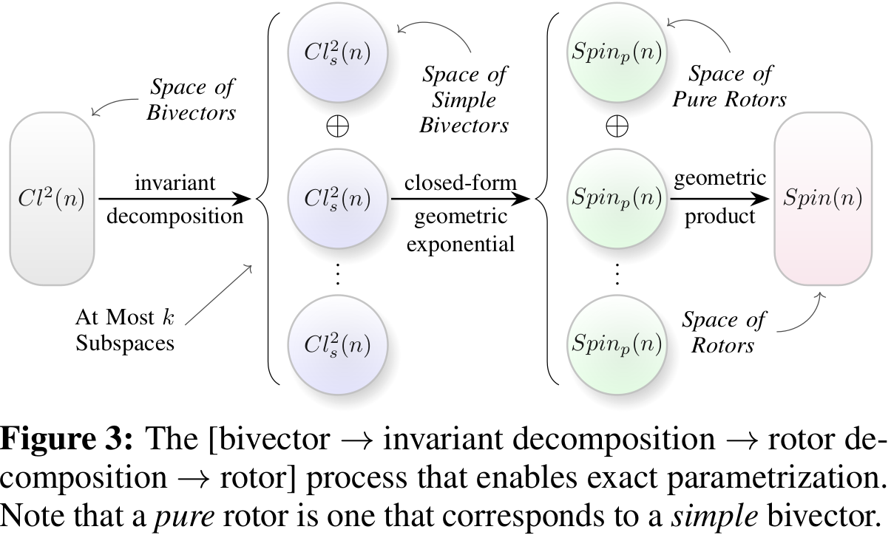
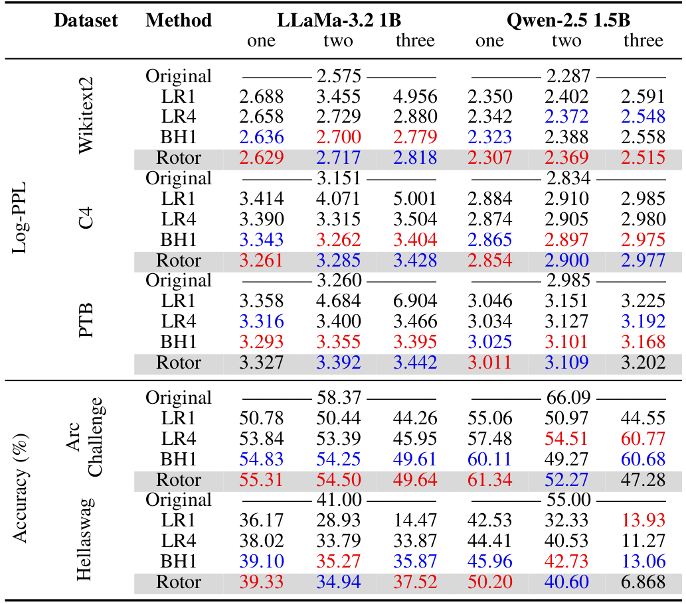
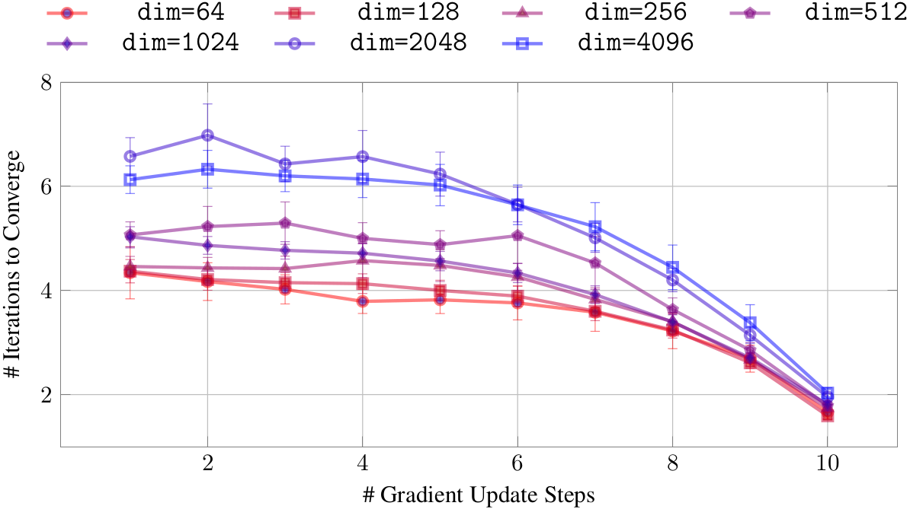

# Composing Linear Layers from Irreducibles

This repository contains the implementation for the NeurIPS 2025 paper "Composing Linear Layers from Irreducibles" by Travis Pence, Daisuke Yamada, and Vikas Singh.

**Paper**: [arXiv:2507.11688](https://arxiv.org/abs/2507.11688)

## Overview

This work demonstrates how linear layers in large language models can be decomposed into geometric primitives (bivectors) using Clifford algebra, achieving exponential parameter reduction from O(d²) to O(log²d) while maintaining competitive performance. We replace key, query, and value projections in LLM attention layers with rotor-based transformations that compose simple geometric rotations. The bivector to rotor process via invariant decomposition is visualized below, which we go into much more detail in the paper and the differential algorithm we present.

<p align="center">
  
</p>

## Setup

1. Clone thhis repo, the submission branch of torch_ga_fix (https://github.com/TravisNP/torch_ga_fix/tree/submission#), and fast-hadamard-transform (https://github.com/Dao-AILab/fast-hadamard-transform.git).
```bash
git clone git@github.com:vsingh-group/ComposingLinearLayers.git
git clone git@github.com:TravisNP/torch_ga_fix.git
git clone git@github.com:Dao-AILab/fast-hadamard-transform.git
cd torch_ga_fix
git checkout submission
cd ../
```

2. Pull the pytorch docker image and create a container
```bash
docker create -it \
  --name ComposingLinearLayers \
  --gpus all \
  -v "$(pwd):/workspace" \
  pytorch/pytorch:2.5.1-cuda12.1-cudnn9-devel \
  bash
docker start ComposingLinearLayers
docker attach ComposingLinearLayers
```

3. Install torch_ga_fix and fast-hadamard-transform
```bash
cd torch_ga_fix/
pip install .
cd ../fast-hadamard-transform/
pip install .
```

4. Install requirements.txt
```bash
cd ../ComposingLinearLayers/
pip install -r requirements.txt
```

5. Set HUGGINGTOKEN environment variable with 
```bash
export HUGGINGTOKEN=<yourtokenhere>
```

## Running Experiments

### Main Experiments

To replace attention layers in different LLMs, navigate to the ComposingLinearLayers directory and run the corresponding script:
```bash
./run/run_<model_name>.sh
```

Available models:
- `run_llama.sh` - LLaMA-3.2 1B / LlaMa-3.2 3B
- `run_qwen.sh` - Qwen-2.5 1.5B
- `run_fox.sh` - Fox-1.0 1.6B

Below are the average PPL for replacing up to three transformer layers of LLaMa and Qwen
<p align="center">
  
</p>

### Projection Convergence Experiment (Appendix D)

To reproduce the projection convergence analysis:
```bash
python -m run.test_projection_convergence
```

Below are the results showing that while larger rotors initially require more iterations to converge, they eventually converge just as quickly as smaller models.
<p align="center">
  
</p>

## Command-Line Arguments

The main script `main.py` accepts the following arguments:

### Required Arguments

- `--layers`: Comma-separated layer indices to replace (e.g., `"12,13,14"`)
- `--root`: Root directory for storing data and model outputs
- `--config`: Path to YAML configuration file (without `.yaml` extension)
- `--dataset`: Dataset for evaluation
  - Options: `arc_challenge`, `hellaswag`, `wikitext`, `c4`, `ptb`
- `--model`: LLM model to use
  - Options: `llama1B`, `llama3B`, `Qwen2.5-1.5B`, `fox`
- `--replacement_type`: Type of layer replacement
  - Options: `rotor`, `lowrank_linear`, `bh_linear`

### Optional Arguments

- `--train_projo`: If set, trains the output projection layer (`o_proj`) after replacing attention layers
- `--eval_datatype`: Data type for evaluation
  - Options: `float32` (default), `bfloat16`
  - Note: Not sure if `bfloat16` works
- `--rank`: Rank for low-rank linear approximation (required when `--replacement_type=lowrank_linear`)
- `--llm_batch_size`: Number of prompts to process simultaneously during data extraction
- `--remove`: If set, deletes extracted training data after processing to save disk space

### Example Usage
See the scripts in the run directory. We have scripts that recreate the experiments for the Fox, LLaMa, and Qwen models

## Configuration Files

Configuration files (`.yaml`) contain hyperparameters specific to each replacement type. See the paper (Appendix C) for details on hyperparameter settings used in experiments.

## Workflow

The pipeline consists of three main steps for each layer:

1. **Data Extraction**: Extract hidden states (inputs) and projection outputs (targets) from the original model using the specified dataset

2. **Training**: Train the replacement layer (rotor, low-rank, or block-Hadamard) to minimize MSE between predicted and true projection outputs
    - Optionally retrain the output projection (`o_proj`) if `--train_projo` is set

3. **Evaluation**: Evaluate on perplexity (for language modeling datasets) or accuracy (for multiple-choice benchmarks)

When replacing multiple layers, they are processed sequentially - each new layer is trained with all previously replaced layers active.

## Citation

If you use this code, please cite:
```bibtex
@inproceedings{pence2025composing,
  title={Composing Linear Layers from Irreducibles},
  author={Pence, Travis and Yamada, Daisuke and Singh, Vikas},
  booktitle={Advances in Neural Information Processing Systems},
  year={2025}
}
```

## Contact

For questions or issues, please open a GitHub issue or contact Travis Pence at tnpence at wisc dot edu.